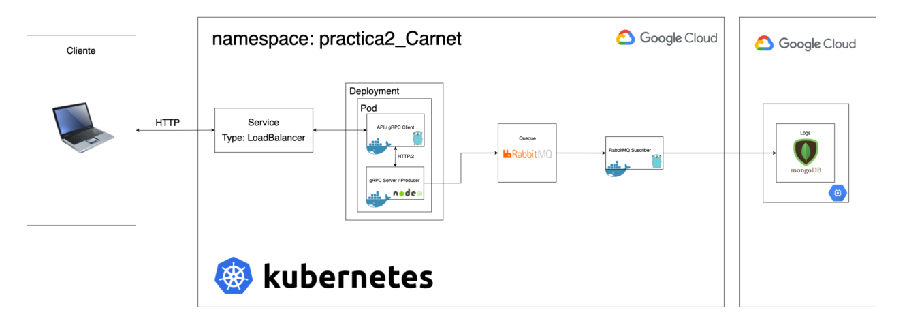

# Manual Técnico

#### Arquitectura del proyecto


## Especificaciones necesarias para ejecutar el proyecto
- Sistema operativo libre
- Docker: versión +18.09.7

## Cliente GRPC
Se creó una aplicación basada en el lenguaje de programación golang que utiliza la tecnología GRPC para manejar procedimientos remotos y así efectuar la evaluación de juegos previamente definidos, el cliente a su vez es un servidor que mediante un endpoint se ejecuta un juego que generará datos.

## Servidor GRPC
Se creó una aplicación basada en el lenguaje de programación javascript con nodejs, se conecta mediante la tecnología GRPC al cliente de go para ejecutar los procedimientos solicitados por los juegos, posteriormente envía el resultado al manejador de colas establecido.

## Manejador de colas RabbitMQ
RabbitMQ es un broker de mensajería de código abierto, distribuido y escalable, que sirve como intermediario para la comunicación eficiente entre productores y consumidores. Este se encarga de recibir los datos que se envían desde el servidor y almacenarlo en una cola que será extraida desde el subscriber.

## Subscriber
Se creó una aplicación basada en el lenguaje de programación golang que se encarga de estar soliciando al manejador de colas rabbitmq la data que este posea, posteriormente es enviada a la base de datos.

## Kubernetes
Es una plataforma de código abierto para automatizar la implementación, el escalado y la administración de aplicaciones en contenedores, en este caso se utilizaran los proporcionados en gcp.

## MongoDB en base de datos
Se utilizó una máquina virtual que aloja una base de datos de mongodb, misma que es ejecutada dentro de un contenedor de docker.

_Comando para levantar la base de datos de mongo._
```sh
$ docker run -d -p 27017:27017 --name db \
-e MONGO_INITDB_ROOT_USERNAME=mongoadmin \
-e MONGO_INITDB_ROOT_PASSWORD=secret \
mongo
```
_Comandos para crear el cluster de kubernetes._
```sh
$ gcloud config set compute/zone us-central1-a
$ gcloud container clusters create practica2cluster --num-nodes=1 --tags=allin,allout --machine-type=n1-standard-2 --no-enable-network-policy
```

_Comando para crear el balanceador de carga._
```sh
$ kubectl expose deploy/despliegue-pod --type=LoadBalancer --port=5000 --namespace=practica2-201807159 --dry-run=client -o yaml >> loadBalance.yaml
$ kubectl apply -f loadBalance.yaml
```