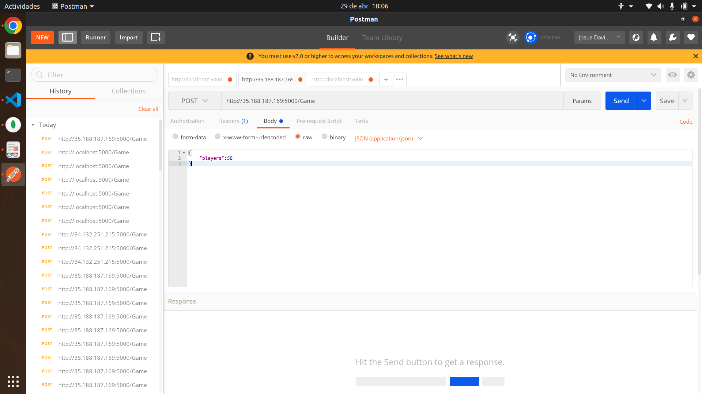
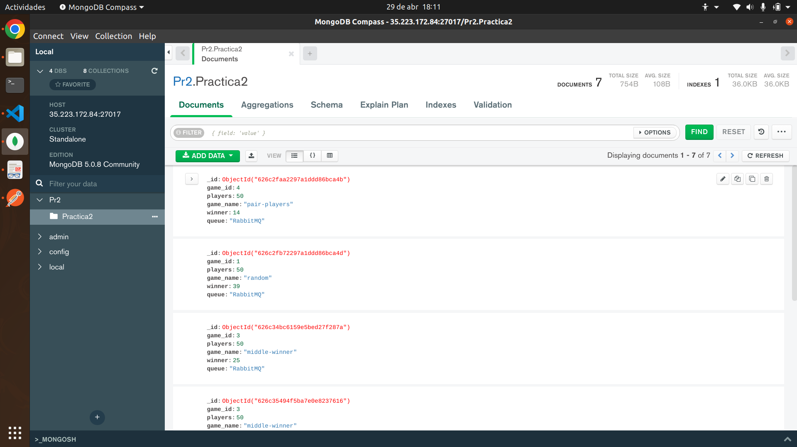

# Manual de Usuario

_Practica 2 - Sistemas Operativos 1_

### Josué David Zea Herrera - 201807159🚀

_En este proyecto podemos visualizar el paso de información mediante un manejador de colas y la tecnólogia grpc alojada dentro de clusteres de kubernetes._

# 📋 Detalle de cada Seccion

### Envío de información mediante el uso de postman
 

_Aquí podemos observar la manera de consumir la api alojada en kubernetes, el endpoint escrito en postman recibe un json con inormación que se necesita para llevar a cabo cada juego._

_El json que se debe enviar en el enpoint debe tener la siguiente estructura:_
```sh
{
    "players": Number //Indica la cantidad de jugadores a participar
}
```

#### Visualizacion de la data recibida en mongo

_Aquí podemos observar el resultado final, una vez se haya enviado la petición, esta genera cierta información de interés que se guardará en mongo para su posterior uso._